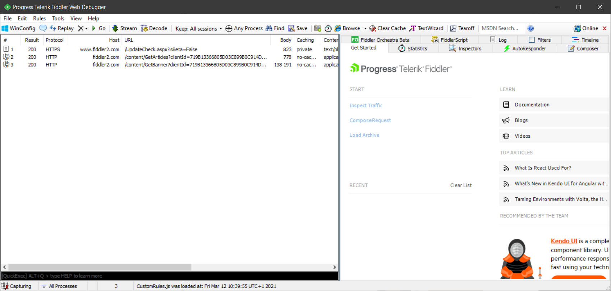
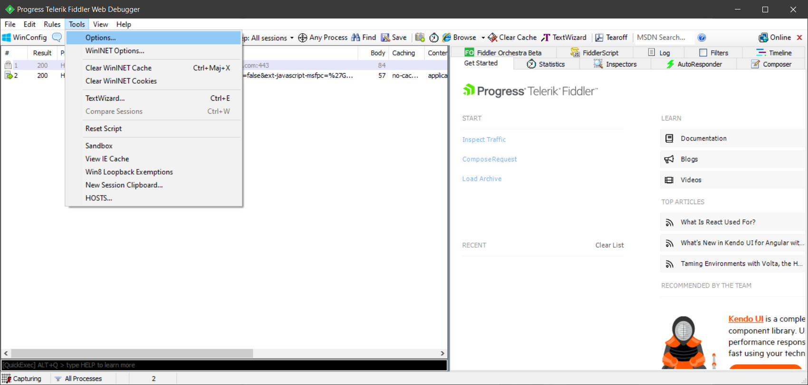
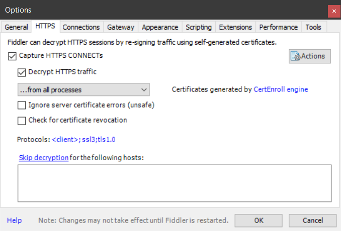
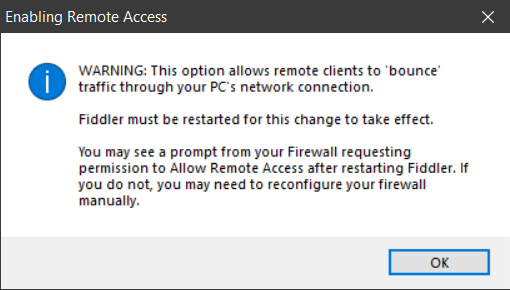
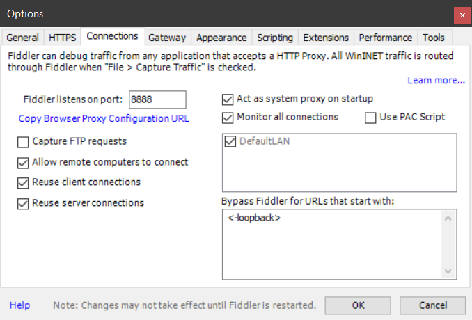
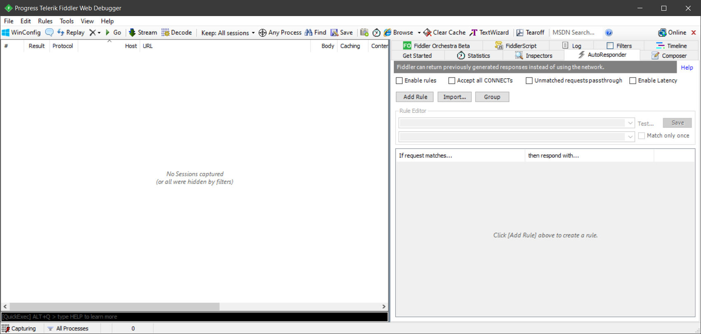
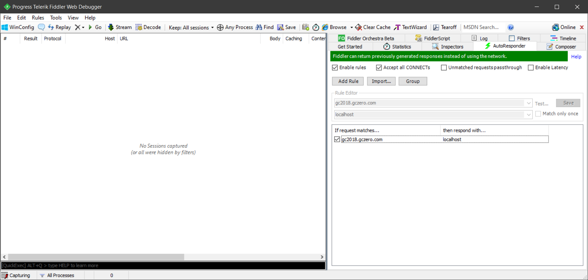
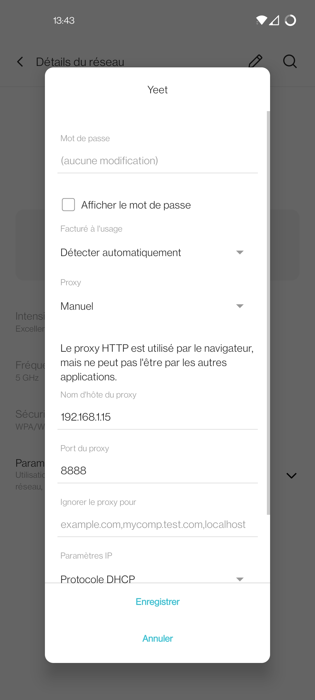
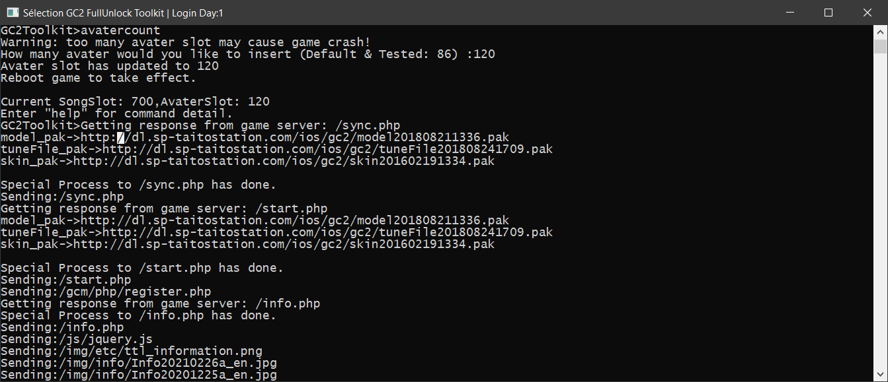
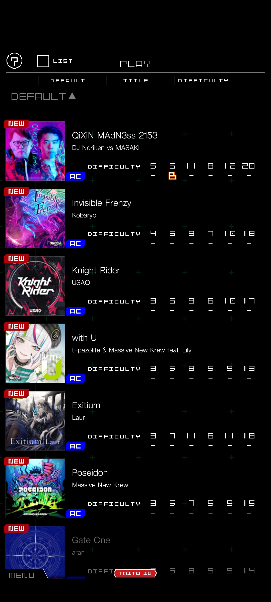

# Groove Coaster 2 iOS/Android : Guide pour obtenir toutes les chansons sans jailbeak/root

Voici un petit guide sympa expliquant comment obtenir **toutes** les chansons du jeu,
sans devoir dépenser des tonnes de thunes ou avoir recourt au jailbreak ou au rootage de l'appareil.

 > **Note** : Des compétences en informatique, disons avancés, sont nécessaires pour mener à bien ces manipulations.
 > Ce guide utilise un exécutable qui met en pratique une attaque [**MTIM**](https://fr.wikipedia.org/wiki/Attaque_de_l%27homme_du_milieu) (Man In The Middle).
 > Ce guide n'a pas pour vocation d'essayer d'entraîner à intercepter des requêtes HTTP. Je rédige ce guide
 > à des fins éducatives et parce que je trouve ça très amusant.
 
 > **Autre note** : N'hésitez **surtout pas** à acheter le jeu sur Nintendo Switch ou Steam. Si vous vous demandez,
 > je possède déjà le jeu sur ma Switch (bien que je n'ai pas trop le temps d'y jouer en ce moment ...)
 > Ce jeu est très sympa et ce serait vraiment dommage de ne pas soutenir des jeux qui valent vraiment le détour.
 
## Prérequis

Pour pouvoir commencer, il va vous falloir quelques outils :

 * Un appareil sous Android/iOS ('fin pour avoir le jeu quoi)
 * Un PC sous Windows (déso pas déso les autres OS ...) 
 * Un réseau (Celui créé par votre box internet suffira amplement)
 * Deux logiciels : *gc2toolkit.exe*, et *Fiddler Classic* (ou autre programme permettant de rediriger le traffic d'un appareil, faites comme bon vous semble)
 
 J'ai dis que des compétences en informatiques avancés sont nécessaires, mais ne vous inquiètez pas, je détaillrai pas mal les démarches. c:
 
### Les deux logiciels
Vous pouvez vous procurer :
 * Fiddler Classic [ici](https://www.telerik.com/download/fiddler)
 * gc2toolkit [ici](https://mega.nz/file/4PoQHSDS#6RrDxSdPxW6tj5Fpyijb3Na5KsUElFsFW5sUN0bltKk)
 
Fiddler est à installer, mais pas gc2toolkit.

### Etape 1 : Mettre en place Fiddler
Maintenant que vous avez installé Fiddler, il va falloir le configuer pour qu'il puisse recevoir les requêtes de votre appareil.

Vous devez normalement arriver dans une fenêtre sembable à celle-ci :



Allez ensuite dans **Tools**, puis **Options** :



Vous vous retrouvez avec une nouvelle fenêtre. Allez ensuite dans l'onglet **HTTPS** puis cochez **Decrypt HTTPS traffic** (ignorez les message qui arrivent ensuite) :

 

Allez ensuite sur l'onglet **Connections** et cochez **Allow remote computers to connect**. 
Ignorez la fenetre d'avertissement qui s'affichera ensuite :



et si vous avez en plus un fenêtre du Pare-Feu Windows, autorisez Fiddler.

**Vérifiez que l'option a bien été cochée** :



Redémarrez ensuite Fiddler en le fermant et en l'ouvrant une nouvelle fois pour appliquer les nouvaux paramètres.

Techniquement, cela suffit pour pouvoir écouter toutes les requêtes HTTP de votre appareil, dont les requêtes du jeu.

C'est fini pour Fiddler ! owo/

## Etape 2 : On s'occupe de gc2toolkit !

Tout en laissant Fiddler ouvert, lancez gc2toolkit **avec les droits administrateurs**.

Le programme devrait afficher :



Ensuite, tapez la commande ```songcount```, puis ```700```.

Appuyez sur la touche entrée pour réafficher l'invite de commande.

Ensuite, tapez la commande ```avatercount```, puis ```120```.

Vous devez arriver à ce résultat :



C'est tout !

## Etape 3 - Connecter votre appareil à votre PC !

A partir de là, cette étape différe légèrement de votre appareil iOS ou Android.

Pour ce guide, on va utiliser mon Oneplus 8T.

Allez dans les paramètres de votre téléphone, puis allez dans les paramètres WIFI.


Séléctionnez votre réseau WIFI, plus modifiez-le pour lui ajouter un **proxy manuel**.


Mettez-y l'adresse IP interne de votre PC, (c'est l'avant-dernière ligne affiché entre tirets dans gc2toolkit,
moi c'est ```192.168.1.15``` par exemple) ainsi que le port, ```8888``` :



**N'oubliez pas d'enregistrer ! owo/**

## Etape 4 - Lancez le jeu

Tout est prêt ! Vous pouvez lancer le jeu que vous avez au préalable installé sur l'App Store / le Play Store !

Vous devriez voir des choses s'afficher sur gc2toolkit :



Si vous voyez ce genre de choses, **c'est bon signe** ! 

Laissez le jeu télécharger ses trucs, ça dure un petit moment.

 > Si le jeu crashe après la fin du téléchargement, n'hésitez pas à redémarrer le jeu, voire carréement relancer gc2toolkit en n'oubliant pas les commandes ci-haut.
 
 Il se peut que le jeu devienne **illisble** après ce téléchargement :
 
<div>


</div>

Peu importe, vous pouvez **quitter le jeu desormais** ! 

**Enlevez le proxy que vous avez mis sur votre appareil**, et relancez le jeu, il devrait re-télécharger des trucs. (Mais c'est plus rapide cette fois !)

Si vous avez bien fais les choses, vous devez **en arriver là** :



**Bien joué ! C'est terminé ! Vous avez débloqué toutes les chansons du jeu ! Félicitations ! :D**


 
 


